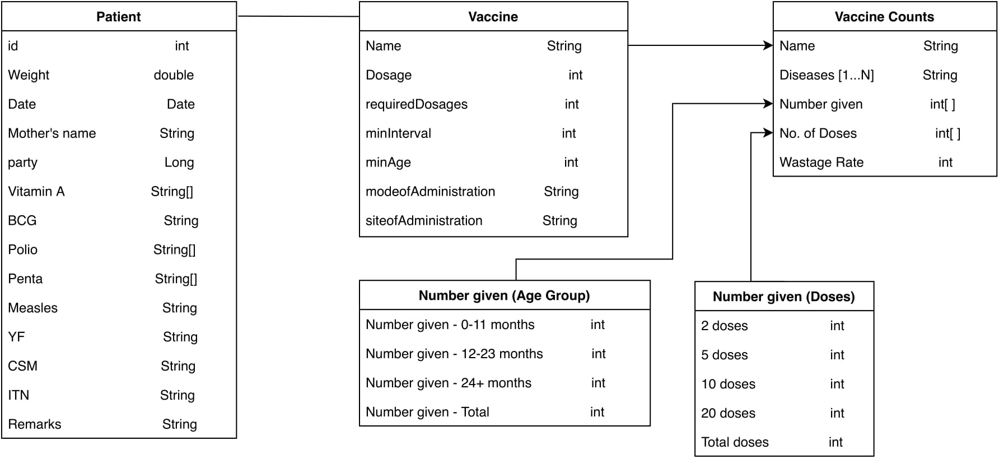
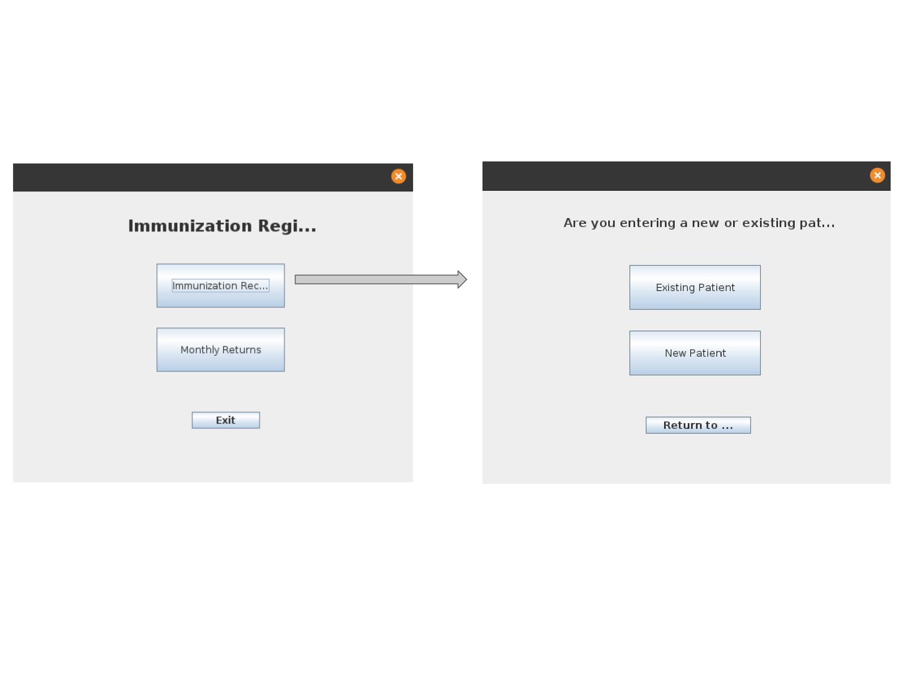
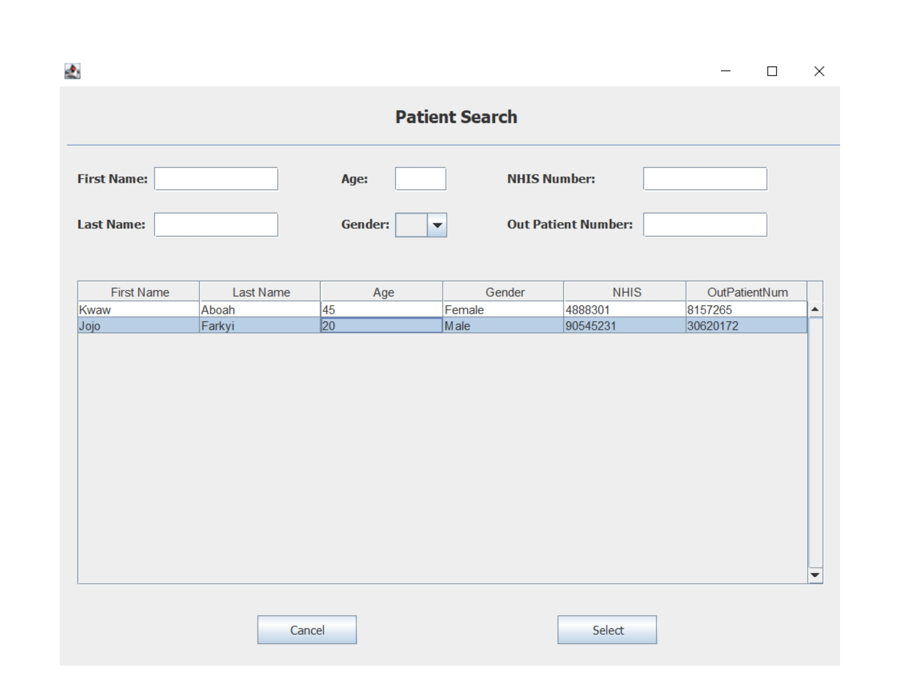
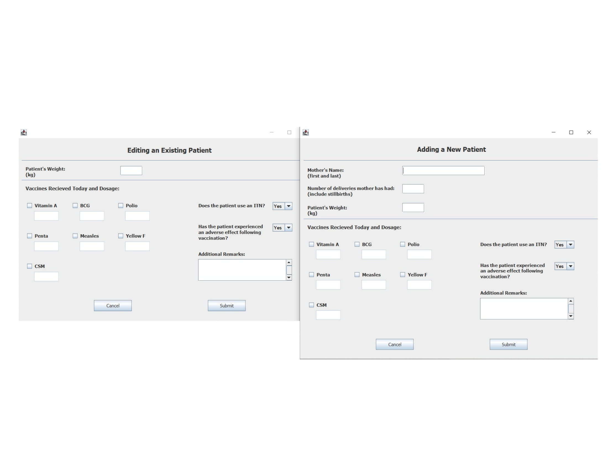
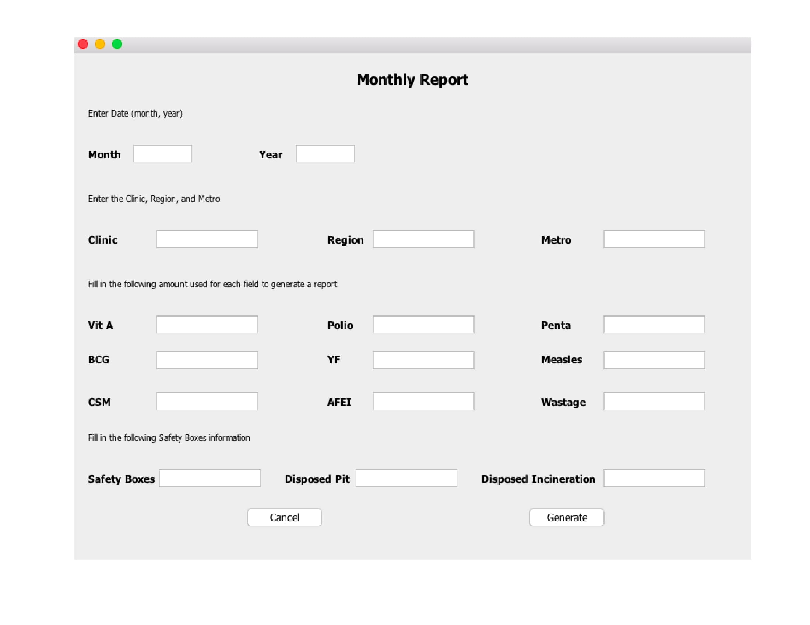
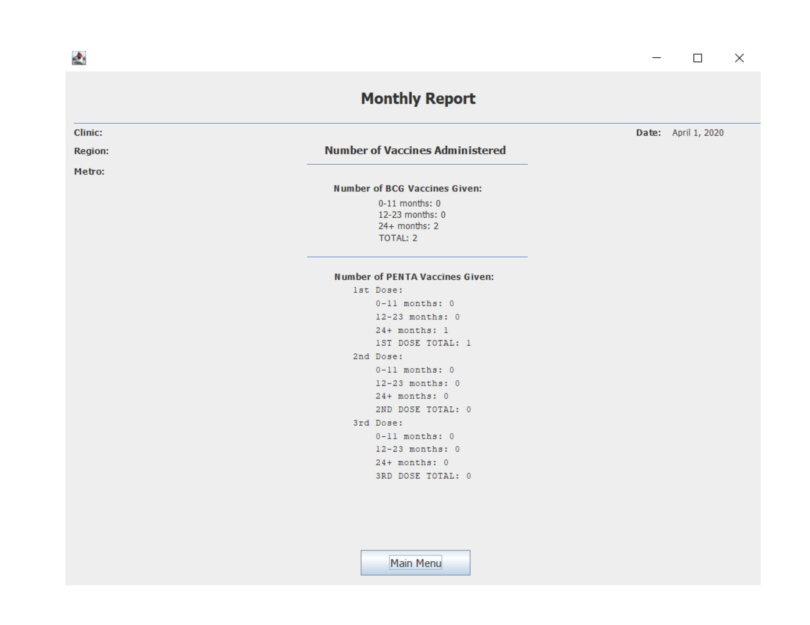

# Childhood Immunizations

Immunizations are an important part of improving child survival. In Ghana, healthcare providers are working to combat lack of healthcare access in rural areas by opening community clinics. However, a big issue they face is that all patient forms and monthly reports are filled out manually. This leads to long wait times when registering new patients and long turnaround times for monthly reports along with other disadavantages. 

The Immunization group plans to resolve this problem by developing a data entry system that stores information for the Immunization Registry and displays it when necessary. Unlike the current paper-based system, the digital system will allow for easy and reliable immunization data retrieval, and provide quicker turnaround times for monthly immunization reports, among other features.

## Team Members

- Calen Cyr
- Marie Hartung
- John Hofacker
- Alexander Millet
- Fazil Shaikh

## Documents and Demos

